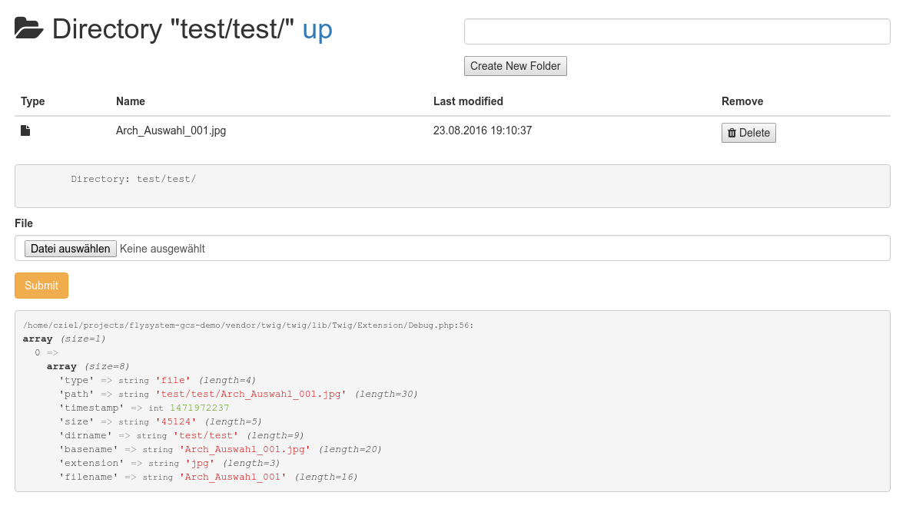

# Flysystem GCS Demo

Small application to demo [cedricziel/flysystem-gcs](https://github.com/cedricziel/flysystem-gcs).

You need a Google Cloud project, a Google Cloud Storage Bucket and
a service account `.json` credentials file.

Place the `.json` file in `res/test-key.json`



## Install

```
composer install
```

Copy the `.env.dist` file to `.env` and change the `GCLOUD_BUCKET` variable
to your bucket name.

## Run

```
COMPOSER_PROCESS_TIMEOUT=0 composer run
```

You can now open http://localhost:8888 and browse your buckets' content.

## License

MIT
